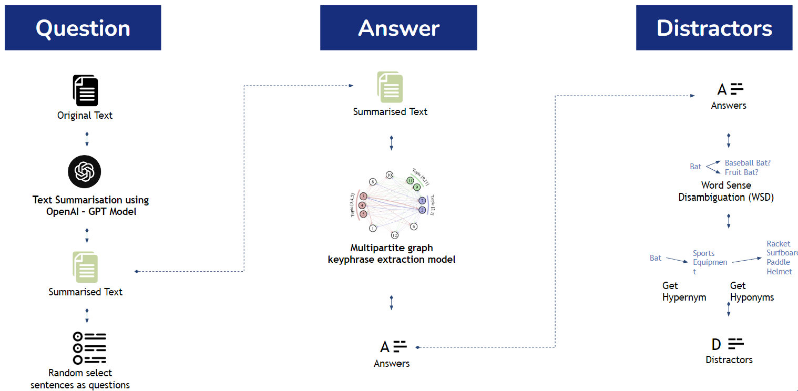

<!-- <div align="center"> -->
### Qgen
<!--  -->


Qgen is a tool that helps you generate Multiple Choice Questions (MCQ) from any text.<br>
Attach your notes, guidebooks and articles to generate questions for your learning.
<br>
<br>
<!-- </div> -->

### Method


<br>
<br>

### Demo


https://github.com/nghuiling/Qgen/assets/47473260/b996a7d0-d64c-42eb-a622-9257611f7eda

<br>
<br>


### Getting Started

1. Clone the repo
   ```sh
   git clone https://github.com/nghuiling/Qgen.git
   ```
3. Install Python packages
   ```sh
   pip install -r requirements.txt
   ```
4. Run Streamlit 
   ```sh
   streamlit run home.py
   ```
<br>
<br>

### Reference

https://towardsdatascience.com/practical-ai-automatically-generate-multiple-choice-questions-mcqs-from-any-content-with-bert-2140d53a9bf5
